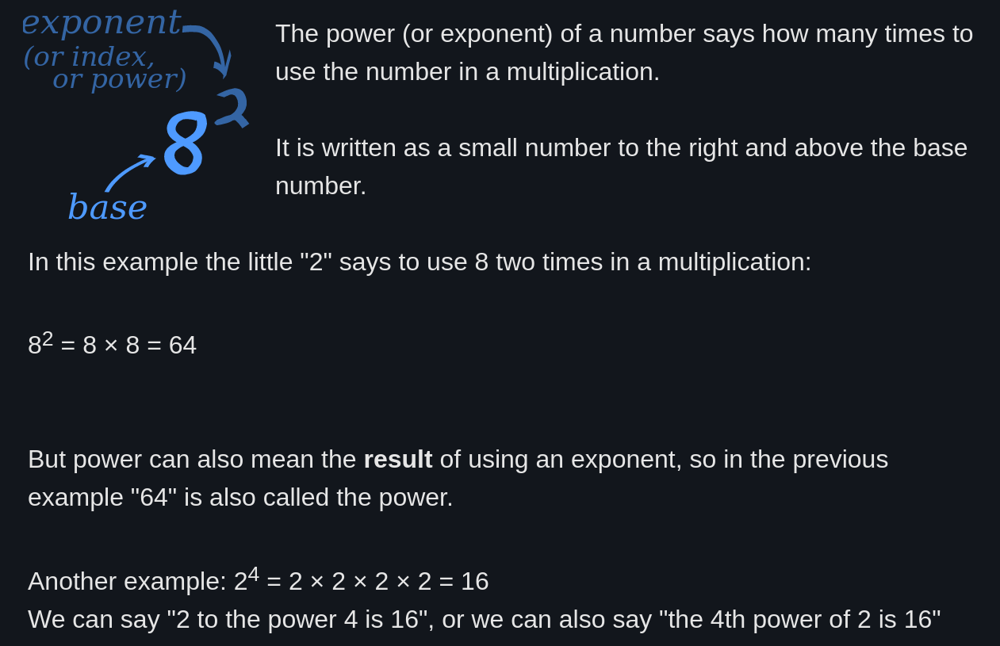

<div align="center" >
    <h1 style="margin:0px"> UWPC </h1>
    <hr style="margin:0px">
    <h2 style="margin:0px"> Question 18 </h2>
    <h3 style="margin:0px"> MO POWA BABEH </h3>
</div>
<br>
Implement pow(x, n), which calculates x raised to the power n (i.e., xn).
<br><br>



#### Input
 - The first line contains a single floating-point number, x. The base.
 - The second line contains a single integer, n. The exponent.

#### Output
 - A single floating-point number to the result of x<sup>n</sup>. The result should be rounded to 5 decimal places (add trailing zeros if necessary).

<hr>

#### Sample 1
##### Input
```
2.00000
10
```
##### Output
```
1024.00000
```
**Explanation**: 2<sup>10</sup> = 1024.0


#### Sample 2
##### Input
```
2.10000
3
```
##### Output
```
9.26100
```
**Explanation**: 2.1<sup>3</sup> = 9.261

#### Sample 3
##### Input
```
2.00000
-2
```
##### Output
```
0.25000
```
**Explanation**: 2<sup>-2</sup> = 1/2<sup>2</sup> = 1/4 = 0.25